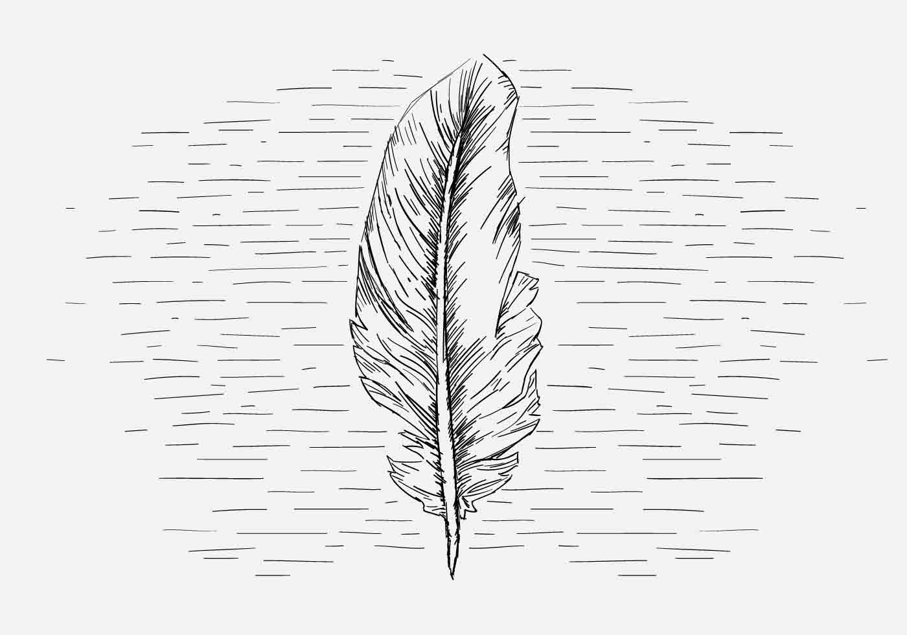
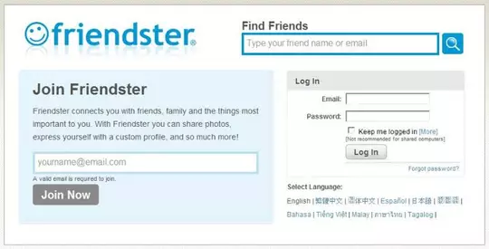
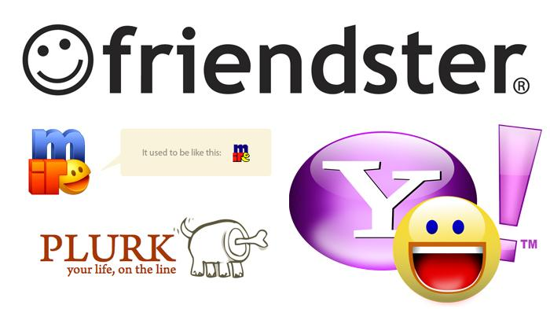
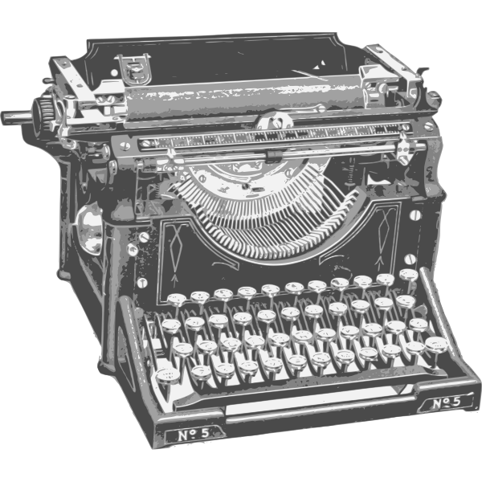

---
title: "A Dead Simple"
date: 2020-08-02
published: true
author: "puji"
images: 'plume.jpg'
---  

  

Assalamualaikum ...  

Halo bra bro yang budiman, perkenalkan saya puji, saya adalah content writter juga author juga developer di situs web statis ini. 

<details>
  <summary>Salam Kenal ... </summary>
  <br/> <br/>
kirain isinya apaan , wkwkwkwkwkwkwkwkwkwkwkwkwkwkwkwkwkkwkwkwkww.
&#128126;&#128126;&#128126;
</details>  

#### &#129302; &#129302;  
Post pertama gout ini adalah sebuah prahara cerita, judulnya a dead simple, mungkin sebuah slogan yang diagungkan kaum minimalist.  
Gout mau sedikit berkisah tentang awal mula gout belajar web developing, saat itu teknologi yang gout pelajari masih materi-materi dasar seperti ***html, css dan javascript*** saat itu pada awal tahun **2006**, awal mula gout memulai pergulatan dalam dunia karier, gout memulai semuanya dari sebuah ***warung internet*** yang saat periode itu merupakan sebuah wahana bermain, belajar dan bekerja, yang di era itu sedang trendy.... haha istilah nya ajah udah oldskull gitu ...  
Diera dekade itu ada beberapa media digital yang amat berpengaruh pada yang menjadi kawah candra dimuka bagi media-media digital di dekade sekarang ini.  
Media digital yang sedang trend saat itu menjadi media gout dalam mempelajari dunia web development.  

  

  


### &#128591; &#128164;&#128164;  

Apa kabar yah dunia digital kali ini, sudah semakin pesat perkembangan dunia digital ini, semoga menjadi manfaat bagi kehidupan ini. Bahwasanya apa yang dicita citakan generasi pendahulu terwujud di era sekarang ini. Betapa kebebasan begitu gencar untuk di gaungkan, maksudnya kebebasan berpendapat dan bergagasan baik.  

Bisa di bayangkan apa yang dialami generasi pendahulu generasi sebelum adanya berbagai media informasi digital yang memberikan kemudahan dalam mengakses segala informasi, baik itu informasi ringan dan juga ilmiah. Semua dapat dilakukan hanya melalui gawai kita. Apapun mulai dari ide sehari-hari, gagasan pikiran dan segala macam informasi seputar tetekbengek kehidupan dibagi hanya dalam sebuah tombol yang bernama ```share```.  

Kini era digital dengan segala ke masivean nya telah mengubah perjalanan hidup seorang manusia yang ingin menumbuhkan segala buah fikirannya, yah semoga apa yang dibagikan adalah sesuatu yang bermanfaat dan baik bagi kehidupan ini terutama di kehidupan generasi selanjutnya atau yang akan datang, segala harapan saya semoga kita bisa mengolah dan menyaring segala bentuk informasi ini dengan pikiran dan perilaku yang bijak.  


  

### Point of view  
Sejatinya tidak ada inovasi di muka bumi ini, tidak ada satu hal pun yang baru di dunia ini, segala sesuatu yang kita anggap baru itu sebetulnya telah di mulai oleh generasi sebelum kita. Orang-orang terdahulu telah memulai segala sesuatu yang di hari ini kita anggap itu sebagai sebuah inovasi dari entitas berpikir kita, padahal kita tidak pernah sedikit pun melakukan satu hal yang baru, semua hanya pengulangan kondisi.  
Tapi apapun itu dibalik segala kondisi yang selalu kita beranggapan bahwa diri kitalah yang paling inovatif di cakrawala bumi ini, apapun itu semoga anggapan inovatif itu masih di dalam situasi yang baik sebagai sebuah kerangka berpikir manusia yang merupakan mahluk paling mulia, sebagai pemelihara planet bumi ini, dan semoga diri kita selalu ingat bahwasanya kitalah yang wajib merawat keberlangsungan kehidupan pertiwi di atas bumi.


Salam ...  


Puji Ermanto As Hamba Allah