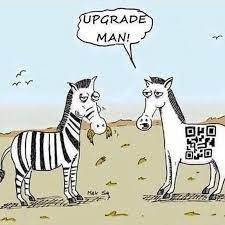

---
title: "Perjalanan Programmer"
date: 2021-08-24
published: true
author: "puji"
images: 'perjalanan.jpg'
---  
### Perjalananku Dalam Menyelami Dunia Programming  

***Assalamualaikum Sobat Digital***  Yang tentunya budiman.  

Kali ini saya ingin berbagi tentang pengalaman atau story yang saya lalui, dimana dalam story ini berisi sebuah pengalaman manis dan getirnya dalam meniti karir menjadi seorang creator dalam skala industri.

Sedikit tentang profile saya singkat saja, saya itu orangnya loyal terhadap sesuatu yang saya kerjakan dan saya cintai, dalam kondisi apapun saya akan menjalankan nya dengan penuh cinta dan tanggung jawab penuh. Bagi saya itu merupakan sebuah keharusan, apapun yang saya kerjakan ada orang-orang yang menunggu atau mengharapkan hasil terbaik dari apa yang saya kerjakan dan jalankan.  

Yang jelas saya senang dengan pekerjaan saya saat ini, membangun sebuah aplikasi berbasis web dimana ketika aplikasi web itu di akses dan dibutuhkan oleh banyak orang tentunya manjadi manfaat baik bagi setiap orang yang menggunakan aplikasi tersebut, itu adalah nilai plus yang menjadi sebuah kepuasan tersendiri.  

  

Saya tidak pernah membatasi pekerjaan saya dari sebuah nilai yang saya maksud nilai disini adalah gaji atau penghasilan. Siapa sih yang gak butuh uang hari ini ? semua orang pasti akan bertanya-tanya seperti itu atau terlintas pertanyaan itu di pikiran. Tapi yah itu saya itu yang saya rasakan dan itu yang menjadi landasan saya, bahwasanya saya lakukan apapun dengan sebaik-baiknya melibatkan cinta dan tanggung jawab penuh dalam mengerjakan sebuah tugas yang menjadi kewajiban saya.  

Dalam fulltime job saya kali ini, yang terbaru adalah saya memegang peranan sebagai seorang fullstack developer di salah satu perusahaan distributor kosmetik dan nutrisi di sebuah wilayah di provinsi jawa timur, sebut saja merk dagangnya adalah evoush. Dan sebuah product digital yang saya kembangkan adalah :  

- evoush official
- evoush consultation application
- evoush web support / web replika member profile  
- evoush backoffice data (order and warehouse data)  

Lumayan ada skill baru yang saya pelajari, ilmu dan pengalaman baru ini yang menjadi harta berharga buat saya, karena saya gak sanggup beli di luar semua yang saya dapat di jobdesk saya yang satu ini, terima kasih pada evoush saya ucapkan, karena disini saya mendapat pengalaman baru di tengah dilema ppkm yang berjilid-jilid dalam generasi pandemi.  

Skill baru yang saya dapatkan adalah bagaimana memprioritaskan User Experience menjadi sebuah keharusan yang hakiki. Selanjutnya management waktu, komunikasi skill yang gak kalah penting karena dengan komunikasi yang lebih baik saya dapat menyampaikan ide-ide di kepala saya dengan bahasa yang lebih sedikit bisa di mengerti manusia lainnya. Modularisasi alur program, efisiensi dalam mengerjakan struktur code. dan masih banyak lainnya skill-skill baru yang saya dapat selama bekerja di evoush. Penuh rasa syukur saya ucapkan atas segala pencapaian diri saya pribadi dan terlebih juga terkhusus untuk evoush yang inshaallah akan semakin maju, selama perjalanan membangun elektabilitas bisnis di masa-masa berikutnya.  

Company Repository : https://github.com/evoush-products
