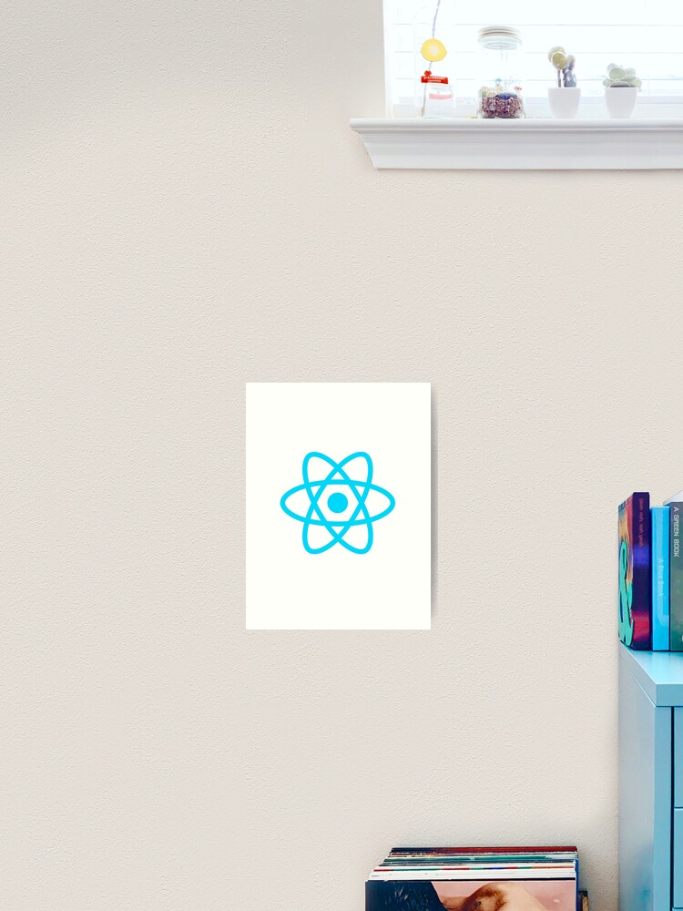

---
title: "Restclient With ReactJS"
date: 2021-03-19
published: true
author: "puji"
images: 'react-artwork.jpg'
---  

  

#### Consuming Rest Api with ReactJS  
Asalamualaikum ...  

halo sobat budiman yang digital dimanapun kalian berada, dan segenap warganet yang beradabsss.  
dalam judul kali ini saya mau berbagi sedikit kisah mengenai rest api, kita akan membuat sebuah rest client yang akan menjalankan method http request ke rest server yang telah kita buat dari artikel sebelumnya ... cel dimari : <a href="https://pujiermanto.vercel.app/about/rest-full-api-with-express-mongoose">Restfull Api with express and mongoDB</a>  
judul ini adalah kelanjutan atau kepanjangan atau part selanjutnya dari artikel tersebut.  

### Persiapan  
Kita install dulu modul ```create-react-app```, selanjutnya kita install package framework reactnya :  
```bash
# create-react-app client/
```  
direktori untuk reatjs saya beri nama client, 

### concurrently  

Concurrently adalah sebuah modul atau package dari node js yang memungkinkan kita untuk menjalankan dua project aplikasi sekaligus dalam satu direktori project, selanjutnya kita install module concurrently nya dulu :  

```bash
# yarn add concurrently
```  
Kemudian setelah proses install selesai, kita buka file package.json, dan kita ubah konfigurasi dibagian key ```"scripts":{}``` sehingga menjadi seperti berikut :  

```json
"scripts": {
    "start": "nodemon --experimental-json-modules server.js",
    "client": "npm start --prefix client",
    "client-install": "npm install --prefix client",
    "dev": "concurrently \"yarn start\" \"yarn run client\""
  },
  ```  

  Selanjutnya kita siapkan module module yang akan kita perlukan di reactJS kita.  
  untuk lebih detailnya bisa di akses di link dibawah ini :  

  repository link react-crud with dummy data :  
<a href="https://github.com/codesyariah122/youtube-chanel-codesyariah/tree/react-with-express">React Hooks</a>


Mudah-mudahan bermanfaat dari artikel gout ini yah.

ok sekian dulu dari saya untuk artikel kali ini, nanti kita lanjutkan lagi artikel mengenai tips and trick seputar pemrogramman khususnya web programming  
... see the next articles 

bye :) 


***Salam***

**Puji Ermanto**
