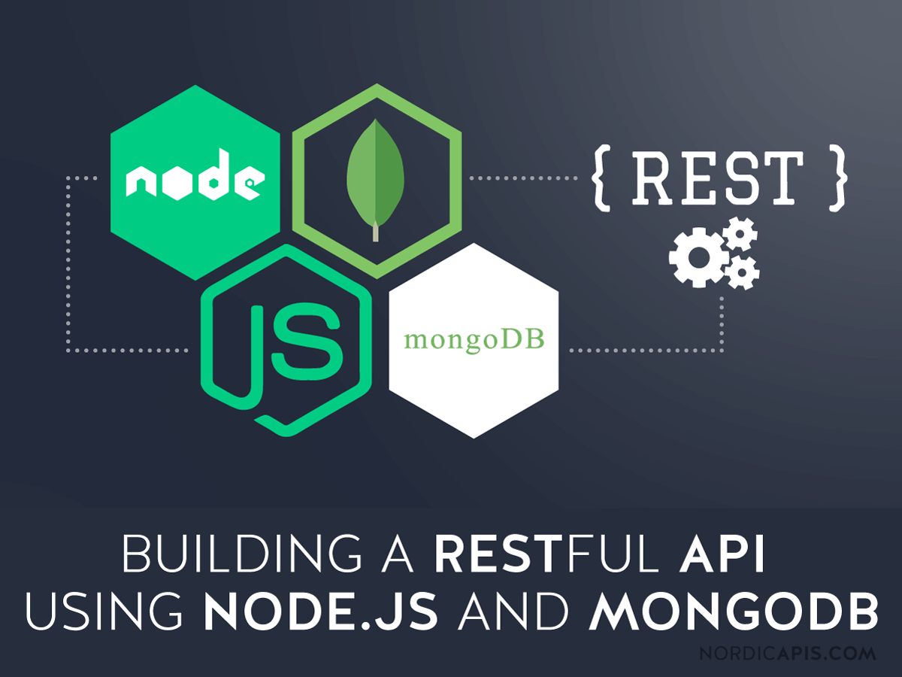

---
title: "RestFull Api With Express And Mongoose(MongoDB)"
date: 2021-02-10
published: true
author: "puji"
images: 'rest-api-express.png'
---  


Assalamualaikum, sobat digital dimanapun berada, salam baca. Semoga kalian semua selalu dalam keadaan sehat selalu, kali ini gout mau sedikit berbagi, yaitu berupa tips trick dan tutorial, kali ini gout akan membahas mengenai proses pembuatan rest full api menggunakan framework ExpressJS dan database MongoDB.   

### Apa itu RestFull Api  
Restfull Api merupakan sebuah layanan yang disediakan dalam proses pertukaran data melalui sebuah metode tertentu dalam hal ini adalah request data melalui HTTP request method, yaitu sebuah metode permintaan dari sebuah client side yang berupa pengolahan data.  
Beberapa metode request yang biasa dimanfaatkan dalam membangun RestFull Api :  
1. GET
    Metode GET meminta representasi sumber daya yang ditentukan. Permintaan menggunakan GET seharusnya hanya mengambil data..
2. HEAD
    Metode HEAD meminta tanggapan yang identik dengan permintaan GET, namun tanpa respon body.
3. POST
    Metode POST digunakan untuk mengirimkan entitas ke sumber daya yang ditentukan, sering menyebabkan perubahan pada keadaan atau efek samping pada server.  
4. PUT
    Metode PUT menggantikan semua representasi terkini dari sumber target dengan muatan permintaan.
5. DELETE
    Metode DELETE akan menghapus sumber daya yang ditentukan.  
Dan ada lagi method request http lainnya yaitu :  

1. CONNECT
    Metode CONNECT menetapkan terowongan ke server yang diidentifikasi oleh sumber target.
2. OPTIONS
    Metode OPTIONS digunakan untuk menggambarkan opsi komunikasi untuk sumber target.
3. TRACE
    Metode TRACE melakukan tes pesan loop-back di sepanjang jalan menuju sumber daya target.
4. PATCH
    Metode PATCH digunakan untuk menerapkan modifikasi sebagian pada sumber daya.  
Kalian bisa simak dari documentation developer mozilla berikut link nya : <a href="https://developer.mozilla.org/id/docs/Web/HTTP/Methods">Developer Mozilla</a>  

### Praktek  
Ok setelah sedikit membahas mengenai RestFull Api dan metode request HTTP berdasarkan teori gembel gout, sekarang kita akan lanjut mempraktekan mengenai proses pembuatan RestFull Api.  
Sebelumnya karena gout mau pakai MongoDB Sebagai basis datanya, maka pertama gout siapkan dulu document bagi data rest api kita, cuuuss langsung saja buka di terminal :  

- Buat document baru  
Akses MongoDB dulu :
```bash
# mongo
MongoDB shell version v4.0.22
connecting to: mongodb://127.0.0.1:27017/?gssapiServiceName=mongodb
Implicit session: session { "id" : UUID("75221bc1-3429-418b-acfe-3a49151f68ea") }
MongoDB server version: 4.0.22
Server has startup warnings: 
2021-02-26T05:28:01.260+0700 I STORAGE  [initandlisten] 
2021-02-26T05:28:01.260+0700 I STORAGE  [initandlisten] ** WARNING: Using the XFS filesystem is strongly recommended with the WiredTiger storage engine
2021-02-26T05:28:01.260+0700 I STORAGE  [initandlisten] **          See http://dochub.mongodb.org/core/prodnotes-filesystem
2021-02-26T05:28:10.493+0700 I CONTROL  [initandlisten] 
2021-02-26T05:28:10.493+0700 I CONTROL  [initandlisten] ** WARNING: Access control is not enabled for the database.
2021-02-26T05:28:10.493+0700 I CONTROL  [initandlisten] **          Read and write access to data and configuration is unrestricted.
2021-02-26T05:28:10.493+0700 I CONTROL  [initandlisten] 
> 
```  
Lanjut buat document baru nya :  

```bash
> use new_db
```  
**penjelasan : perintah diatas kita akan membuat sebuah document baru dengan nama ```new_db```.**  

- Buat collections :  
```bash
 db.createCollection("books")
{ "ok" : 1 }
> show collections
books
>
```  
**penjelasan: perintah diatas adalah kita membuat sebuah collection dengan nama ```books``` karena kita akan membuat sebuah daftar data buku***  
Selanjutnya menyiapkan field key dalam collections ```books```, untuk membuat field baru kita bisa juga malakukannya seperti ini, sekaligus menginsert sebuah test data atau dummy data :  

```bash
> db.books.insert({judul: "Bumi Manusia", penulis: "Pramoedya Ananta Toer", genre: "Roman", penerbit: "Hasta Mitra"})
WriteResult({ "nInserted" : 1 })
```  
cek hasil insert dummy data :  

```bash
> db.books.find()
{ "_id" : ObjectId("603914805142f074393b0642"), "judul" : "Bumi Manusia", "penulis" : "Pramoedya Ananta Toer", "genre" : "Roman", "penerbit" : "Hasta Mitra" }
> 
```  

Ok ! sejauh ini database MongoDB telah selesai, dan kita sudah menyiapkan data terkait untuk di gunakan di aplikasi RestFull Api kita. Lanjut kita buka code editor  

#### Mulai coding  
Penggunaan code di artikel ini masih sama dengan artikel sebelumnya, berikut susunan direktori nya :  
```bash
# direktori rest-api(root direktori) :  
root@debian:/home/puji122/rest-api# ls -l
total 176
-rw-r--r--   1 puji122 puji122   144 Feb 26 20:24 app.js
drwxr-xr-x 219 root    root    12288 Feb 26 20:45 node_modules
-rwxrwxrwx   1 root    root      560 Feb 26 20:45 package.json
drwxr-xr-x   2 puji122 puji122  4096 Feb 26 20:23 src
-rw-r--r--   1 root    root    67712 Feb 26 06:01 yarn-error.log
-rw-r--r--   1 root    root    72502 Feb 26 20:45 yarn.lock

# direktori rest-api/src :  
root@debian:/home/puji122/rest-api/src# ls -h
 middleware.js  
 router.js 
 controller.js  
 listen.js  
 model.js	 
 server.js
root@debian:/home/puji122/rest-api/src# 
```  
File utama kita masih menggunakan file app.js dan file lainnya adalah untuk memodularisasi alur program rest api kita.  

kita buat file tambahan di direktori ```src/``` yaitu file index.js dan file config.js yang akan kita gunakan untuk mengkonfigurasi koneksi MongoDB:  

```bash
root@debian:/home/puji122/the-rest/src# touch index.js config.js
```  
Lanjut kita buka file ```src/index.js``` :  

```javascript
import Server from './server.js'
import Config from './config.js'

export {Server, Config}
```  
Selanjutnya adalah buka file ```src/server.js``` dan ubah codenya menjadi seperti berikut :  
```javascript
import {Listen} from './listen.js'

const Server = (port) => {
	Listen(port, () => {
		console.log(`Halo server sudah berjalan di port : ${port}`)
	})
}

export default Server
```  

selanjutnya untuk membuat konfigurasi MongoDB kita buka kembali file ```.env``` dan tambahkan url mongo db kita disertai nama database setelah ```url_mongo/nama database``` :  

```text
PORT=8081
ORIGIN='http://localhost:3000'
DB_URL='mongodb://127.0.0.1:27017/new_db'
```  
***sebagai info untuk melihat url mongo db kita bisa lihat saat akses mongo db kita : ***  
```bash
root@debian:/home/puji122/rest-api/src# mongo
MongoDB shell version v4.0.22
connecting to: mongodb://127.0.0.1:27017/?gssapiServiceName=mongodb
Implicit session: session { "id" : UUID("c1f9007c-4693-46ab-913a-25c18f46f5c9") }
MongoDB server version: 4.0.22
```  
atau bisa juga menjalankan perintah berikut :  
```bash
root@debian:/home/puji122/rest-api/src# mongo --eval 'db.runCommand({connectionStatus: 1})'
```  

Selanjutnya yang akan kita ubah adalah file ```src/config.js``` di file ini kita akan mengaktifkan connection MongoDB kita, Oh iya ... sebelumnya kita akan menggunakan module package mongoose framework untuk melakukan handle pada MongoDB kita, install terlebih dahulu module mongoose nya menggunakan ```npm``` atau ```yarn``` :  
```bash
root@debian:/home/puji122/rest-api# yarn add mongoose@5.11.15
```  

file package.json : 

```json
{
  "name": "the-rest",
  "version": "1.0.0",
  "main": "server.js",
  "license": "MIT",
  "type": "module",
  "scripts": {
    "start": "nodemon --experimental-json-modules app.js"
  },
  "dependencies": {
    "body-parser": "^1.19.0",
    "cors": "^2.8.5",
    "dotenv": "^8.2.0",
    "express": "^4.17.1",
    "mongoose": "5.11.15",
    "nodemon": "^2.0.7"
  }
}

```

selanjutnya kita bisa membuka file ```src/config.js``` dan tambahkan code berikut :  

```javascript
import mongoose from 'mongoose'

const Config = () => {
	mongoose.connect(process.env.DB_URL, {
		useNewUrlParser: true,
		useUnifiedTopology: true
	})
	.then(() => {
		console.log('Connection Success ! ')
	})
	.catch((err) => console.log(err))

	mongoose.set('useFindAndModify', false)
}

export default Config
```  
Setelah file ```src/config.js``` di save, selanjutnya kita buka file utama project rest-api kita ```app.js``` untuk memulai connection ke MongoDB kita, ubah code ```app.js``` seperti berikut :  

```javascript
import dotenv from 'dotenv'
import {Server, Config} from './src/index.js'

dotenv.config()
const port = process.env.PORT
Config()

Server(port)
```  
Selanjutnya kita akan mengubah code di file ```src/model.js```, untuk mulai melakukan manipulasi data pada MongoDB, ubah code ```src/model.js``` seperti berikut :  

```javascript
import mongoose from 'mongoose'

const bookSchema = mongoose.Schema({
	judul: String,
	penulis: String,
	genre: String,
	penerbit: String
})

bookSchema.method('toJSON', function(){
	const {__v, _id, ...object} = this.toObject()
	object.id = _id
	return object
})

const BookData = mongoose.model('books', bookSchema)

export default BookData
```  
**catatan: pada bagian ```const BookData``` terdapat method model yang dijalankan oleh module mongoose dan parameternya adalah nama ```collections``` dan ```Schema``` mongoose untuk MongoDB kita**  

di pembahasan sebelumnya kita sudah membuat document baru beserta collections dan dummy datanya di collection ```book``` dan document atau databasenya ```new_db```.  

Setelah file ```src/model.js``` kita akan mengubah code untuk file ```src/controller.js```, kita ubah code di file tersebut menjadi seperti ini :  

```javascript
import BookData from '../models/index.js'
import mongoose from 'mongoose'

export const getData = async(req, res) => {
	try{
		const books = await BookData.find()
		res.status(200).json({
			data: books
		})
	}catch(err){
		res.status(404).json({
			message: err.message
		})
	}
}

export const getDataById = async(req, res) => {
	const id = req.params.id
	try{
		const books = await BookData.findById(id)
		res.status(200).json({
			data: books
		})
	}catch(err){
		res.status(404).json({
			message: err.message
		})
	}
}

export const getDataByPenulis = async(req, res) => {
	const penulis = req.params.penulis
	try{
		const books = await BookData.find({"penulis": {$regex: `.*${penulis}.*`}}, (err, result) => {
		
			if(result.length === 0) {
				res.status(200).json({
					data: `${penulis} data buku belum tersedia`
				})
			}else{			
				res.status(200).json({
					data: result
				}) 
			}
			
				
		})
	}catch(err){
		res.status(404).json({
			message: err.message
		})
	}
}


export const createBooks = async(req, res) => {
	const bookdata = req.body
	try{
		const books = new BookData(bookdata)
		await books.save()
		res.status(201).json({
			data: books
		})
	}catch(error){
		res.status(409).json({
			message: error.message
		})
	}
}

export const updatedBooks = async(req, res) => {
	const id = req.params.id
	const {judul, penulis, genre, penerbit} = req.body

	if(!mongoose.Types.ObjectId.isValid(id)) return res.status(404).send(`Buku dengan id : ${id}, data tidak ditemukan`)

	const books = {judul, penulis, genre, penerbit, id}

	await BookData.findByIdAndUpdate(id, books, {new: true})

	res.status(200).json(books)
}

export const deletedBooks = async(req, res) => {
	const id = req.params.id
	if(!mongoose.Types.ObjectId.isValid(id)) return res.status(404).send(`Buku dengan id : ${id}, data tidak ditemukan`)

	await BookData.findByIdAndRemove(id)
	res.status(200).json({
		message: "Deleted Bookdata successfully"
	})
}
```  

terdapat beberapa method diatas yang di fungsikan untuk menjalankan metode request HTTP nantinya di file ```src/router.js```.  

Ok Selanjutnya kita ubah code lagi di file ```src/router.js```, ubah menjadi seperti ini :  

```javascript
import Router from 'express'
import {getAllData, getDataById, getDataByPenulis, createBooks, updatedBooks, deletedBooks} from './controller.js'

const router = Router()

router.get('/show', getAllData)
router.get('/show/id/:id', getDataById)
router.get('/show/penulis/:penulis', getDataByPenulis)
router.post('/store', createBooks)
router.put('/update/:id', updatedBooks)
router.delete('/delete/:id', deletedBooks)
export default router
```  
difile router lah semua request client ke sever kita akan dijalankan, selanjutnya kita bisa melakukan uji coba bagi tiap-tiap routes nya menggunakan aplikasi ```postman``` atau menggunakan ```curl``` di terminal kita.  

 

#### Curl GET  
```bash
root@debian:/home/puji122# curl -H GET http://localhost:8081/api/data/show
[{"judul":"Tetralogy Buru","penulis":"Pramoedya Ananta Toer","genre":"Roman","penerbit":"Hasta Mitra","id":"6036e210e0d8e104c0b7dda1"},{"judul":"'Tenggelamnya Kapal Van Der Wijck'","penulis":"'Prof. Dr. Hamka'","genre":"'Roman'","penerbit":"'Gema Insani'","id":"6038f3546fb9de9c6a5edd4a"},{"judul":"'Gadis Kretek'","penulis":"'Ratih Kumala'","genre":"'Roman'","penerbit":"'Balai Buku Progresive'","id":"6039091fd4ff791998e8cdb0"}]root@debian:/home/puji122# 
```  

#### Curl POST  

```bash
root@debian:/home/puji122# curl -d "judul='La Grande Borne'&penulis='Nh. Dini'&genre='Novel Drama'&penerbit='PT Gramedia Pustaka Utama'" -X POST http://localhost:8081/api/data/store
{"data":{"judul":"'La Grande Borne'","penulis":"'Nh. Dini'","genre":"'Novel Drama'","penerbit":"'PT Gramedia Pustaka Utama'","id":"60391e78c764371f10e6e50b"}}root@debian:/home/puji122# 
```  

#### Curl PUT  

```bash
root@debian:/home/puji122# curl -d "judul='La Grande Borne'&penulis='Nh. Dini'&genre='Novel Drama Roman'&penerbit='PT Gramedia Pustaka Utama'" -X PUT http://localhost:8081/api/data/update/60391e78c764371f10e6e50b
{"judul":"'La Grande Borne'","penulis":"'Nh. Dini'","genre":"'Novel Drama Roman'","penerbit":"'PT Gramedia Pustaka Utama'","id":"60391e78c764371f10e6e50b"}root@debian:/home/puji122# 
```  


#### Curl DELETE  

```bash
root@debian:/home/puji122# curl -X DELETE http://localhost:8081/api/data/delete/60391e78c764371f10e6e50b
{"message":"Deleted Bookdata successfully"}
root@debian:/home/puji122# 
```  
  

Untuk percobaan dari sisi client atau frontend bisa menggunakan framework ```ReactJS``` ```VueJS``` ataupun ```Angular```, atau mungkin bisa juga secara native. Untuk pemanfaatan dari sisi client atau RestClient nanti akan gout bahas di artikel terpisah.


ok sekian dulu dari saya untuk artikel kali ini, nanti kita lanjutkan lagi artikel mengenai tips and trick seputar pemrogramman khususnya web programming  



... see the next articles 

bye :) 


***Salam***

**Puji Ermanto**
