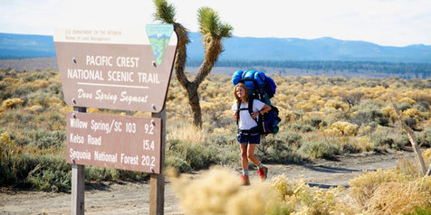

---
title: "Tak selamanya perjalanan untuk sebuah pencarian"
date: 2021-10-29
published: true
author: "puji"
images: 'perjalanan-pencarian.jpg'
---  
### Perjalananku Bukan Perjalananmu Apalagi Perjalanan Dia

***Assalamualaikum Sobat Digital***  Yang tentunya budiman.  

Dalam melaksanakan tugas kita sebagai mahluk budiman di muka bumi ini, senantiasa kita dihadapkan pada seklumit permasalahan, namun bukan kehidupan namanya jika tak menemui sebuah permasalahan. Permasalahan adalah bagian dari sejarah peradaban kehidupan, semua mahluk yang di beri nyawa tinggal di alam semesta ini ... semuanya tidak akan pernah lepas dari pemasalahan.  

Apaan sih ngomongin permasalahan !  

Yahh... itu opening yang menggetarkan sulbi-sulbi jiwa, hanya sekedar mengingatkan bahwasanya dalam menjalani hidup ini kita harus mengingat bahwa ini semua adalah perjalanan, namanya juga menjalani berasal dari kata jalan, bisa berarti berjalan, jalan-jalan dan segala apapun yang berhubungan dengan movement, pergerakan, perpindahan, semua benda semua mahluk akan mendapatkan perjalanannya masing-masing. Sudah merupakan hukum fisika semua mahluk di takdirkan untuk berjalan, entah itu berjalan untuk menempuh suatu perjalanan yang sesungguhnya ataupun perjalanan dalam arti luas yang lainnya.  

***Dari Perjalanan Gue !***  
apa sih yang gue dapetin ?  
apa sih yang gue cari ?  
apa sih yang  lu mau ? loe maunya apa bro ?  
  
Yaelah malah nyengir bro ! bro ! ...  

Dari perjalanan gue, sejujurnya gue gak ngerti apa yang ingin gue cari, dan akhir perjalanan seperti apa yang bakal gue temuin, belum tau juga dan belum pasti juga. Tapi gue selalu yakin setiap jalan yang gue pilih dan gue tempuh semua ada makna, ada arti dan ada cerita yang mungkin menjadi sebuah ilmu baru, pengetahuan baru, khazanah baru tentang arti perjalanan itu sendiri.  
Sekali kali kita melipir ke kiri, sekali kali kita menyimpang ke kanan bahkan kita terpaksa mundur beberapa langkah untuk mencapture beberapa moment dan menyimpan juga mengingatnya sebagai sebuah cindramata alam semesta. Setiap jarak dalam perjalanan kehidupan seorang mahluk senantiasa beriringan bersama sang waktu, sang waktu ini adalah hakim paling adil yang akan membuat keputusan kapan akhir perjalanan atau kapan kita harus beristirahat dari setiap rangkaian perjalanan yang kita lalui ini. Kadang kala hati bergetar betapa kecilnya seorang mahluk itu di bandingkan dengan alam semesta dan sang waktu itu seberapa besarkah dia menentukan jadwal ronda, mengingatkan jadwal pertandingan liga sepak bola, semua dari yang remeh temeh tak berguna semua nya hadir dalam rangkaian waktu yang selalu beriringan bersama kita untuk menjadi hakim perjalanan kehidupan kita.  

Inilah kehidupan, perjalanan adalah nafas yang selalu berhembus, nadi yang selalu berdenyut dan pikiran yang selalu terbuka luas menarik garis cakrawala ke dalam kalbu kita.  

Selamat beristirahat, selamat berkarya bagi yang sedang sibuk dengan berkarya dalam perjalanannya. Semoga kita semua mendapatkan perjalanan terbaik dalam melaksanakan tanggung jawab kita sebagai seorang mahluk... ya cuma seorang mahluk.